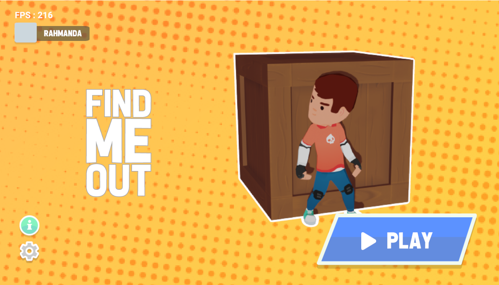

# Find Me Out

### Authors

* [Ilham Pratama](https://gitlab.com/pratamailham206)
* [Aditya Nur Juang Rahmanda](https://github.com/adityarahmanda)

## Game Overview

Find Me Out is a casual online hide and seek game. Players are divided by two roles, the hider and the seeker. The roles are generated randomly. The objective for the seeker is to catch all the hiders before the time ends. For hiders, the objective are to survive until time ends. Hiders are invisible from the eye of the seeker, but there are some obstacles the hiders must be avoided or they will gonna show their positions.

### Feature

- Power up item for the seeker in the arena for easy capture.
- Customize your character with all available skins in the game.
- Vote your favorite map to play in next match.

### Genre

Casual, Running, Maze

### Platform

Windows

### Gameplay

### High concept and design

* Slide presentation [here](https://docs.google.com/presentation/d/1iKG1R4ODLgdfETCUvkQC1HMsZjzAIpZa15-YXZ4JAZA/edit#slide=id.p)
* High concept document [here](https://gitlab.com/pratamailham206/find-me-out/-/blob/master/Documents/4210181020_4210181021_GDD_Find_Me_Out.docx)

## Running the project

After cloning or downloading the repository, open both the server and client project in unity and press the Play button.

## Prerequisites

Unity 2020.2.1f1 or higher

## Multiplayer Feature Documentation

### Connection

We use TCP and UDP protocol in this project. The game starts by connecting both server and client.

### Packets

Data sents are recognized by the enumerations in Packet.cs, there's also packetHandlers dictionary in both server and client that contains function handlers for every packets received.

### Authentication

We use firebase to store account and user authentication. The client will sends input data to the server. Server then will validate the data using the firebase API and sends back the validation result to the client.

### Lobby

All the players are sent into lobby before the game started. The client sends player ready data to the server and the server will broadcast the information to all the clients. The game will start after all the players in the lobby is ready.

### Wardrobe

Player can change its skin using the wardrobe system. There are 8 skin available in the game. The client sends the selected skin texture id to the server and the server then broadcast it to all the clients. After that, all the clients change the player texture skin by the texture id given.

### Countdown Timer

After the game is starting, server gonna broadcast countdown timer to all the clients to syncronize the time between client and server. The server will set hiders as the winner if the countdown timer is reaching zero. 

### Field of View

The seeker has field of view to catch the hiders. When hider is collided with the field of view, it will be caught by the seeker. The server gonna broadcast the caught hiders to all the clients.

### Item Spawner

Every certain duration, server will spawn item in a random place and broadcast the spawned item data to all the clients.

### Mud

The hiders will be slowed when it touch the mud. The mud also gonna make footprints behind the player. Server will broadcast the footprint data to all the clients.

### Win Status

The game will ends after the server announce the winner. The winner is broadcasted and triggered after the countdown is reaching zero or all the hiders is caught.

## License

This project is licensed under the MIT License - see the [LICENSE](LICENSE) file for details
